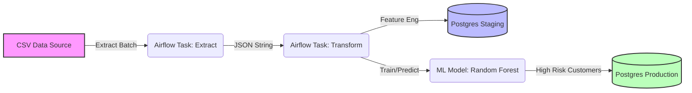

# 🏦 Financial Risk Assessment - MLOps & ETL Pipeline


> Một dự án **End-to-End Data Engineering & MLOps** mô phỏng quy trình đánh giá rủi ro tín dụng khách hàng. Hệ thống tự động hóa việc trích xuất dữ liệu, xử lý, huấn luyện mô hình Machine Learning và đẩy cảnh báo về Database Production trên máy cục bộ (Hybrid Architecture).

---

## 📖 Tổng quan (Overview)

Dự án này giải quyết bài toán: **Làm thế nào để tự động hóa việc đánh giá rủi ro tài chính từ dữ liệu thô?**

Hệ thống hoạt động theo luồng dữ liệu tự động:

1.  **📡 Extract:** Đọc dữ liệu tài chính từ CSV theo cơ chế Batch (giả lập Streaming 100 dòng/lần).
2.  **🛠️ Transform:** Làm sạch dữ liệu, xử lý giá trị thiếu (`NaN`), mã hóa (Encoding) và chuẩn hóa (Scaling).
3.  **🤖 Machine Learning:** Huấn luyện mô hình **Random Forest** để dự đoán điểm tín dụng.
4.  **💾 Load:**
    * Lưu *Feature Store* vào **Staging DB** (Docker Internal).
    * Lưu *Khách hàng rủi ro cao* vào **Production DB** (Local Machine).

---

## 🏗 Kiến trúc Hệ thống (Architecture)



## 📂 Cấu trúc Dự án (Project Structure)
```financial_project/
├── dags/
│   └── financial_dag.py          # DAG chính định nghĩa luồng xử lý Airflow
├── plugins/
│   ├── extract.py                # Đọc file CSV và xử lý JSON Serialization
│   ├── transform.py              # Logic làm sạch, Imputation, Scaling
│   ├── load.py                   # Logic Upsert (Idempotency) vào PostgreSQL
│   └── ml_model.py               # Huấn luyện Random Forest & Dự báo
├── data/
│   ├── Financial_risk_assessment.csv  # Dataset nguồn
│   └── state.txt                 # File lưu trạng thái batch (Offset)
├── docker-compose.yaml           # Cấu hình Infrastructure (Airflow + DBs)
├── Dockerfile                    # Cấu hình môi trường Python
├── requirements.txt              # Các thư viện phụ thuộc
└── README.md                     # Tài liệu dự án

